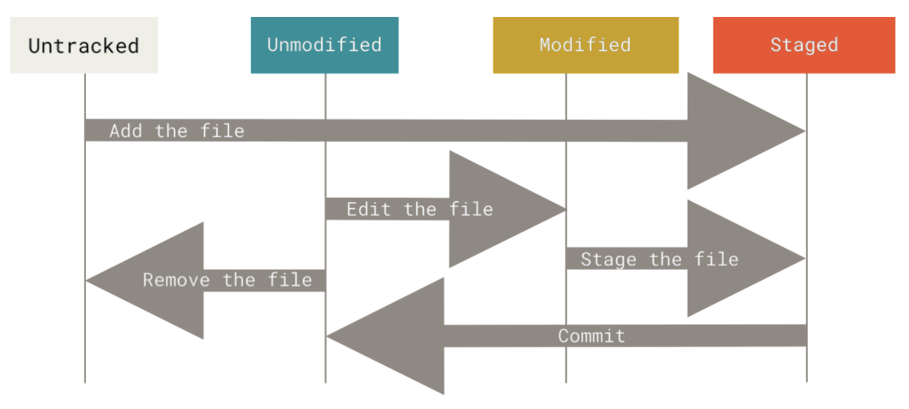
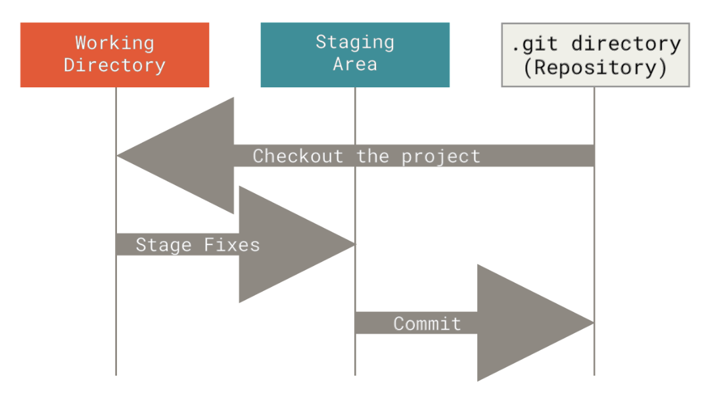

# Theory
This section is for theoretical info about git as notes from the Pro Git book and my own additions as well.

## File states

### Modified
File modified but not committed

### Staged
File modified and will be in the commit snapshot

### Committed
File is stored in the local database

## Project sections

### Working tree
A single checkout of one version of the project.
These files are pulled out of the compressed database in the Git directory and placed on disk for you to use or modify.

### Staging area
File, generally contained in your Git directory, that stores information about what will go into your next commit.
Its technical name in Git is the “index”.

### Git directory
Where Git stores the metadata and object database for your project.
This is the most important part of Git, and it is what is copied when you clone a repository from another computer.

## Workflow
1. Modify files in your working tree.
2. Stage just those changes you want to be part of your next commit, which adds only those changes to the staging area.
3. Commit, which takes the files as they are in the staging area and stores that snapshot permanently to your Git directory.

# Practical Examples
This section contains documentation to keep track of what I have done in this repo and what kind of experiments I have done with git.

All of these happen and affect only the files in the files/ directory in this repository, so for example, when in this section I'm refering to the file example-file, what I really mean is the file files/example-file.

## Merge conflict
Affected files: merge

After the commit (unrelated what it actually is, just know it's a commit before this merging example began) <a href="https://github.com/2xer/tr/commit/30b089e24513a8304cc0174e5dd26bece52f0a5a">30b089e</a> I created a branch called "experimental".

On master branch I added a line to document that "Damn, the fridge is empty." and commit the change.

On experimental branch I added a line to document that "Nice, there's an apple in the fridge." and commit the change.

I then switched to master to merge the changes of experimental into master (`git merge experimental`).

Git let me know there's a conflict so I edited the file, picking only one of the changes to resolve the conflict.

Then I delete the experimental branch.

Now you can see in the in the commit history (`git log`) that the change I made to resolve the conflict is the (then) latest commit, with 2 parent commits <a href="https://github.com/2xer/tr/commit/19bdbb508b6dc4f62eeab66dfa062b62accca162">19bdbb5</a> and <a href="https://github.com/2xer/tr/commit/06d9bf492bd392ca9fbd74822bf93e3ba1caedf7">06d9bf4</a> instead of the normal 1.

# Useful commands and flags

## add
1. Interactively choose hunks of patch between the index and the work tree and add them to the index.

`git add -p`

## commit
1. Automatically stage files that have been modified and deleted, but new files you have not told Git about are not affected.

`git commit -a`

2. Reuse commit message from existing commit or last commit on current branch by using HEAD.

`git commit --reuse-message=HEAD`

## log
1. Show the commits in a graph and in a more concise and readable format.

`git log --graph --decorate --abbrev-commit --all --pretty=oneline`

## status
1. More compact status but uses 1 or 2 capital letters or symbols to represent changes to files (`man git-status`).

Left-hand column shows status of files in the staging area while the right-hand column shows the status of files in the working tree.

`git status -s`

# Credits
Pro Git book, written by Scott Chacon and Ben Straub and published by Apress.
Available here https://git-scm.com/book/en/v2
Licensed under Creative Commons Attribution-NonCommercial-ShareAlike 3.0 Unported (CC BY-NC-SA 3.0) license.
